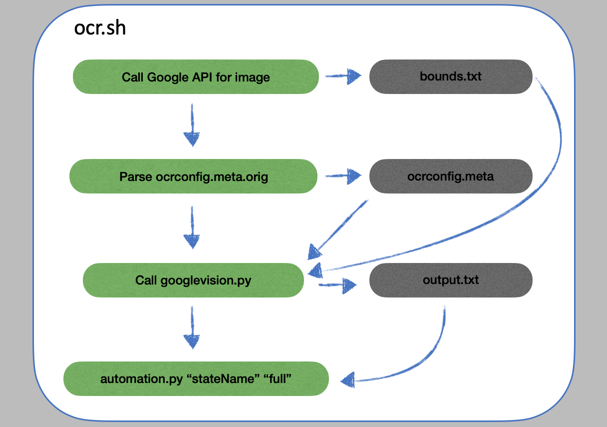

***A scrapper for multiple covid state websites. Triedcatched's ghost!***

***Used by www.covid19india.org admin teams. Not for general consumption :P :D***


# Usage  
Currently there are three types of bulletins:

1. Images - AP, AR, BR, CT, JH, JK, HP, MH, MP, NL, PB, RJ, TG, TN, UK, UP
2. PDFs - HR, KA, KL, PB, TN, WB
3. Dashboards - CH, GJ, ML, OR, PY, TR, Vaccines

For all those where ocr is supported (optical character recognition using google vision api), the command to run is:  
```./ocr.sh "fully qualified path to image" "State Name" "starting text, ending text" "True/False" "ocr/table/automation"```

Parameter description:
1. "fully qualified path to image": Example "./home/covid/mh.jpg" The path cannot be relative path but it should have the fully qualified path.  
2. "State Name": This is the state for which the image is being passed. Example: "Andhra Pradesh". 
3. "starting text, ending text": This is the starting text of an image which considered to be the begining of a bulletin. In case you want auto detection to kick in, use "auto,auto". In some of the cases, if the bulletin has a text above the table with district names, consider cropping the image to have only the table with district data.  
4. "True/False": This parameter is used in case you want to translate the district name (True: yes, please translate. False: No, do not translate). As of now this is applicable only to UP and BR bulletins.  
5. "ocr/table/automation": This is an option provided where in case you want to skip one or more of the steps (ocr, table creation or automation.py run), you can provide those steps in comma separated manner. Example: "ocr,automation" will skip both ocr step and the automation step. "ocr,table" will skip image reading and table creation, but will run automation.py step to compute the delta.


# How does ocr.sh work?


For any bulletin to be parsed, we use Google Vision API free tier. All the steps are called via ocr.sh. 
1. First, [google vision api is called](https://github.com/bee-rickey/webScraper/blob/68441dbbd0aff5980b8984bcd2cee701950e96c9/automation/ocr/ocr.sh#L159) on the image to generate bounds.txt file. This is a direct output from the Google Vision API. This needs to be parsed to figure out the tablular structure.
2. Next, "ocrconfig.meta.orig" [file is parsed](https://github.com/bee-rickey/webScraper/blob/fbb055addff6bfefcee45853e34e238b25f3092e/automation/ocr/ocr.sh#L188) and this generates ocrconfig.meta file. This file is used to tweak the way a table is interpreted in a bulletin.
3. ocr.sh internaly [invokes googlevision.py](https://github.com/bee-rickey/webScraper/blob/fbb055addff6bfefcee45853e34e238b25f3092e/automation/ocr/ocr.sh#L193) file as well. This file is responsible for using ocrconfig.meta file and read the output generated by the Google Vision API (bounds.txt). The output of this step is generation of an output.txt file. This file has textually converted data of the image passed (basically a csv file with a row for each district given in the image). 
4. In the last step, [the bounds.txt file is copied](https://github.com/bee-rickey/webScraper/blob/fbb055addff6bfefcee45853e34e238b25f3092e/automation/ocr/ocr.sh#L196) into automation/.tmp/stateCode.txt and [automation.py is invoked](https://github.com/bee-rickey/webScraper/blob/fbb055addff6bfefcee45853e34e238b25f3092e/automation/ocr/ocr.sh#L202) to generate the delta values for the state across all districts.

NOTES: 
- Since output.txt is an intermediate file, in case there are issues wrt bulletin being converted into text, then, the feature of skipping ocr and table generation can be used after correcting values in output.txt. Example: *./ocr.sh <image> <State> auto,auto False "ocr,table"*.
- OCR is heavily dependent on how good the image quality is. If the quality of image is bad, the output of google vision api might not be good enough to generate data.
- Since googlevision.py script tries to auto identify the bulletin table, it alwalys searches for district names and assumes the line with the first occurance of a district name is the starting of the table. Hence, in case there are notes above a table with district names, the image has to be cropped to remove the text above the table.


# How does googlevision.py work?  
  1. Google Vision API gives each text that it recognises and coordinates of a rectangle around the text it matches. 
  Example:
  ```
    9248|bounds|245,326|281,326|281,343|245,343
  ```
  This shows 9248 was found with bottom left coordinate of 245,326, bottom right of 281,343, top right of 281,343 and top left of 245,343
  
  The idea is to use this information to figure out which all texts in an image fall on the same lines and same columns. 
  2. googlevision.py uses the bounds.txt file which contains this information to generate an internal class per text. This class has the following [definition](https://github.com/bee-rickey/webScraper/blob/47182b314849e1f99ea48a3c537c3a1104513560/automation/ocr/googlevision.py#L38):
  ```
  class cellItem:
  def __init__(self, value, x, y, lbx, lby, w, h, col, row, index):
    self.value = value
    self.x = x
    self.y = y
    self.col = col
    self.row = row
    self.index = index
    self.lbx = lbx
    self.lby = lby
    self.h = h
    self.w = w
  ```
  Definitions:
  ```
  x - mid point of the text in x direction
  y - mid point of the text in y direction
  col - a column number assigned to the text (all texts that fall with same x coordinate with a given tolerance will have the same col number)
  row - a row number assigned to the text (all texts that fall with same y coordinate with a given tolerance will have the same row number)
  index - a unique number identifying each text
  lbx - the left bottom x coordinate of the text (used for drawing a rectangle around the text)
  lby - the left bottom y coordinate of the text (used for drawing a rectangle around the text)
  h - height of the text (calculated using  left top y - left bottom y)
  w - width of the text (calculated using right bottom x - left bottom x)
  ```
  3. For each text found in the image, using it's rectangular coordinates, the mid points are calculated.
  4. The next steps involve figuring out the row and column numbers. For this the logic is simple:  
    - If the x coordinates are same, then the lie on the same column (in case hough transformation is used, all texts within the bounds of two consecutive lines should have the same column number).  
    - If the y coordinates are same, then they lie on the same row.  
  However, [a tolerance](https://github.com/bee-rickey/webScraper/blob/47182b314849e1f99ea48a3c537c3a1104513560/automation/ocr/googlevision.py#L321) is considered while arriving at col and row numbers.
  5. In order to arrive at the rows (lines) that matter, the starting text and the ending text parameters are used. The moment a line with the starting text is encountered, it is assumed to be the first line of the table. If the starting text is kept as "auto", in that case, the code checks for the first line containing a district name as the starting of the table.
  6. Next step is to print all those with the same row in the same line but with a sorting on the x coordinate (column value). While printing some of the corner scenarios like district names with space need to be considered and handled. 
  7. In case the district names are in Hindi, then before printing, the text has to be converted into English using a translation dictionary which is used.
  8. The output is put into a file named output.txt. This file will have a 1-1 conversion of the bulletin table that has districts information.
  
# How does automation.py work?
  1. automation.py uses api endpoint at covid19india.org to figure out the difference per district from bulletin to the api endpoint.
  2. automation.py has different modes of operation - ocr, pdf, dashboard.  
    - For ocr, the .tmp/statecode.txt file is used to compute the delta (this comes from ocr.sh run).  
    - For pdfs, pdftotext and camelot are used to convert a pdf into a csv file and then use it for delta calculation.  
    - For dashboards, beautifulsoup or sometimes plain json pulls are used to get the information to calculate the delta. 
  3. In case of pdfs, there's an option to specify which page number to read and parse. The format is:
  ```
    ./automation.py "statename" full pdf=<urlOfThepdf>=<pageNumber> 
    ./automation.py "stateName" full pdf==<pageNumber> (this in case you manually place the pdf as .tmp/stateCode.pdf)
  ```
  4. For dashboards, a meta file automation.meta has the dashboard endpoint from which to read and parse the data.
  5. For each state, there has to be an entry in automation.meta file (even if it's driven by ocr). The meta file has the stateCode to consider for picking up the file from .tmp folder. The state code also allows for standardization of code. Each state has a <stateCode>GetData() function which acts as the entry point for the calculations. Example:
  ```
  def TRGetData():
    response = requests.request("GET", metaDictionary['Tripura'].url)
    soup = BeautifulSoup(response.content, 'html.parser')
    table = soup.find("tbody").find_all("tr")

    districtArray = []
    for index, row in enumerate(table):
      dataPoints = row.find_all("td")
      
      districtDictionary = {}
      districtDictionary['districtName'] = dataPoints[1].get_text().strip()
      districtDictionary['confirmed'] = int(dataPoints[8].get_text().strip())
      districtDictionary['recovered'] = int(dataPoints[10].get_text().strip())
      districtDictionary['deceased'] = int(dataPoints[12].get_text().strip())
      districtArray.append(districtDictionary)

    deltaCalculator.getStateDataFromSite("Tripura", districtArray, option)
  ```
  
  
  # How does this code sit in the grand scheme of automation at covid19india.org?
botto.png
Essentially, the idea is that volunteers send the request over a telegram bot that is then [configured to trigger the script](https://github.com/covid19india/automation-bot/blob/master/src/ocr_functions.py) when a command is required. 
